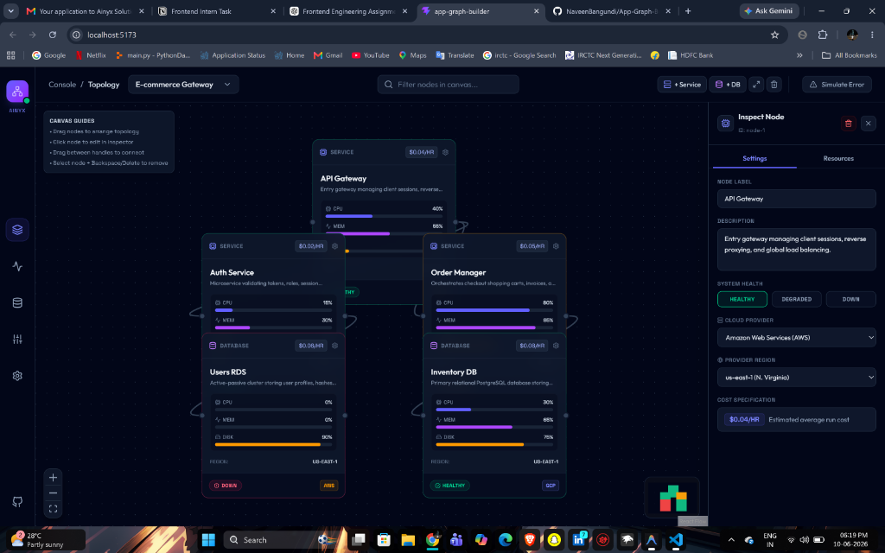
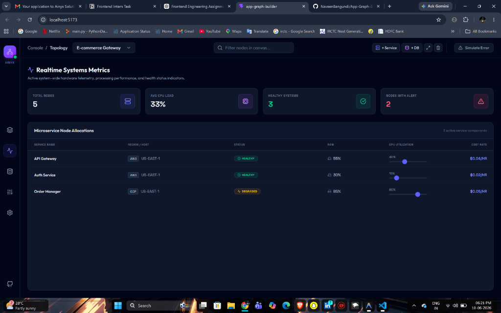
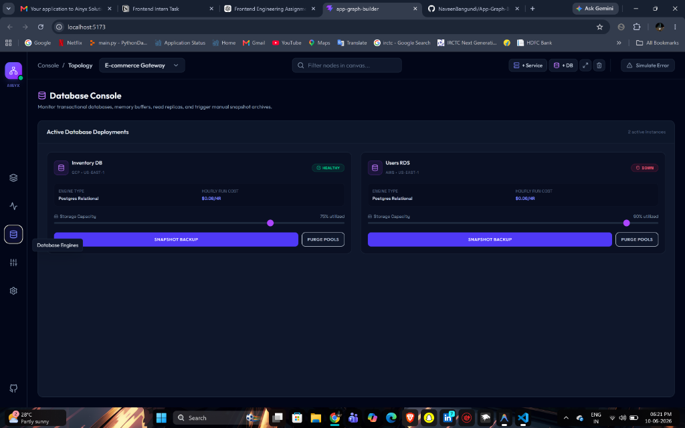
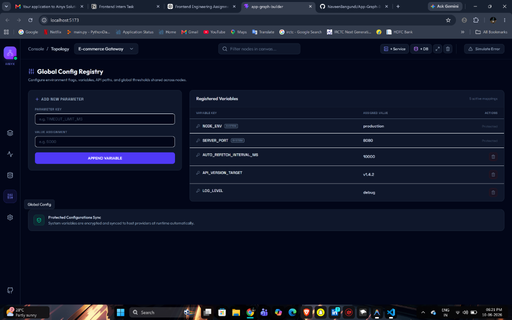
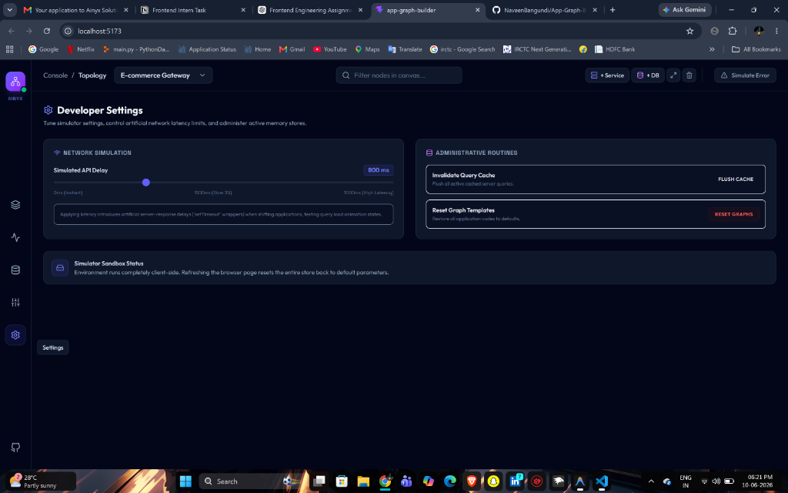

# 📊 App Graph Builder

A responsive, high-fidelity **App Graph Builder** dashboard that allows cloud engineers to select target applications, visualize microservice topologies as interactive graphs, configure individual service specifications in a details inspector, and view system telemetry.

### 🖥️ Application Screenshots

#### 1. Topology Graph Canvas


#### 2. Realtime Systems Metrics


#### 3. Database Engine Console


#### 4. Global Configurations Registry


#### 5. Developer Settings Panel


---

## ⚡ Key Features

* **Interactive Graph Canvas (ReactFlow)**:
  * Visualize app structures with specialized node models for **Services** and **Databases**.
  * Dynamic node operations: select, drag to arrange, connect, and delete nodes natively.
  * Search filter that highlights matching canvas nodes and dims out other elements.
* **Functional Left-Navigation Rail**:
  * **Topology Graph**: Main interactive ReactFlow layout.
  * **Realtime Metrics**: Telemetry dashboard tracking CPU usage, active workloads, and healthy/alert metrics.
  * **Database Console**: Administration view featuring active connection monitors and trigger controls for manual snapshots.
  * **Global Config Registry**: Registry manager to view, add, and delete environment parameters.
  * **Developer Settings**: Sandbox tuning panel with sliders to control API network delay, flush cached queries, and reset layouts.
* **Bidirectionally Synced Inspector**:
  * Edit names, descriptions, host providers, and health statuses.
  * Sync CPU/RAM/DISK sliders bidirectionally with numeric text inputs (mutating one updates the other instantly).
* **Network Failover Simulator**:
  * Trigger outage screen simulator to test load indicators and retry connection hooks.

---

## 🛠️ Tech Stack & Architecture

* **Frontend Framework**: [React 19](https://react.dev/) + [Vite](https://vite.dev/) + [TypeScript](https://www.typescriptlang.org/)
* **Graph Rendering**: [@xyflow/react](https://reactflow.dev/) (ReactFlow 12)
* **Styling & Theme**: [Tailwind CSS v4](https://tailwindcss.com/) (Dark Mode)
* **Client State Management**: [Zustand](https://zustand-demo.pmnd.rs/)
* **Server State & Caching**: [TanStack Query v5](https://tanstack.com/query/latest)
* **Icons**: [Lucide React](https://lucide.dev/)

---

## 🚀 Getting Started

### Prerequisites
Make sure you have [Node.js](https://nodejs.org/) (v18+) installed.

### Installation
1. Clone the repository:
   ```bash
   git clone https://github.com/NaveenBangundi/App-Graph-Builder.git
   cd App-Graph-Builder
   ```

2. Install dependencies:
   ```bash
   npm install
   ```

3. Start the local development server:
   ```bash
   npm run dev
   ```
   *The application will boot up at `http://localhost:5173` (or `http://localhost:5174` if port 5173 is in use).*

### Production Build
To run TypeScript compiler checks and compile the production bundle:
```bash
npm run build
```